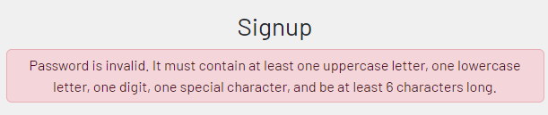
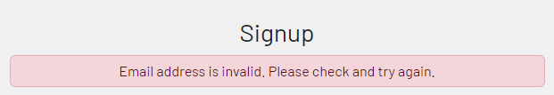
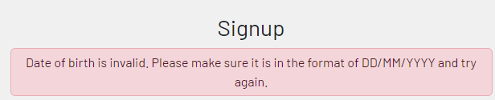
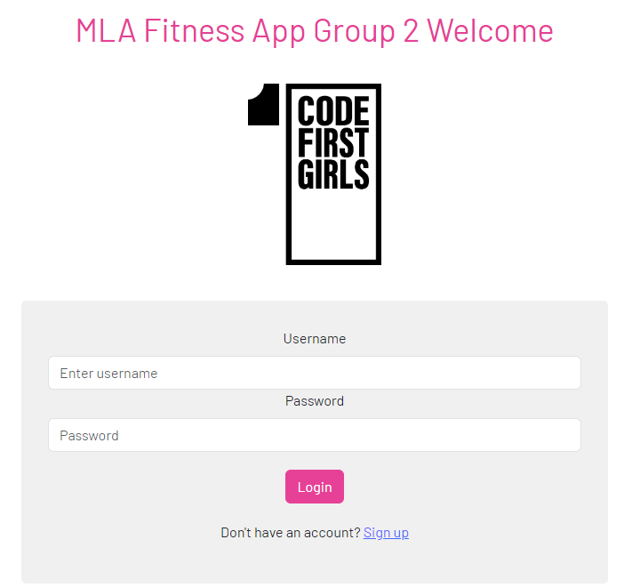
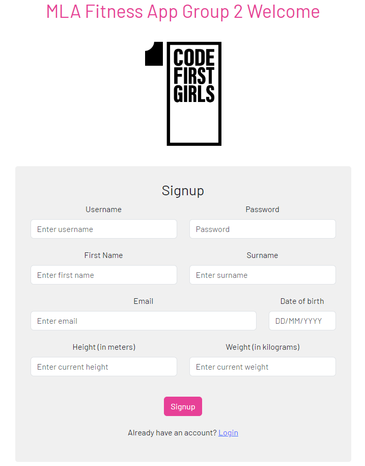

# MLA Fitness App
# Authentication Microservice

This service builds the authentication component of the Fitness Tracker App, exposing the Login and Singup pages to the user. This allows a new user to signup to the app, and a returning user to login if correct credentials are provided. The user object is saved to the database.

The Authentication service uses Java / Gradle tech stack.

# Original Features
- Allows user to sign up to the app, creating a user object containing username and password.
- Username and password stored in MongoDB database.
- User can login to app by submitting correct credentials.
- Permits user to enter the app by checking credentials against the database.

# Prerequisites
- Java
- Gradle
- MongoDB
- npm or yarn

# Developments
- MongoDB split into two databases authdb and activitydb.
- Adding password validation for signup, ensuring user password meets rules - improve security.
- 22/03/2024 - adding new properties to user class, adding fields to signup and user profile - capturing user personal info to tailer calculations to them.
- 31/03/2024 - adding header to signup page.
- 03/04/2024 - adding verification checks for email address and date of birth into SignUpService.java file. Adding alerts for user so they are aware of verification failures.

# Updates to Signup:
The Signup page has been developed to capture additional information about the user when they signup to the app. This was done so that calculations in the app could be personalised for the user, making them more accurate. The weight of the user is currently being used to calculate the calories burned for tracked exercises.

The Signup page now requests the following information:
- Username
- Password
- First name
- Surname
- Email Address
- Date of birth
- Height
- Weight

### Validation:

There are validation checks built-in to the authController which use a string patterns to check user inputs comply.

1. Password - must contain minimum of 6 characters, 1 upper case, 1 number and 1 special character.

2. Email Address - follows generic validation rules for email addresses.

3. Date of birth - valid date between 1900 and 2999 and is in the format of DD/MM/YYYY.

# Current Pages View:

 

