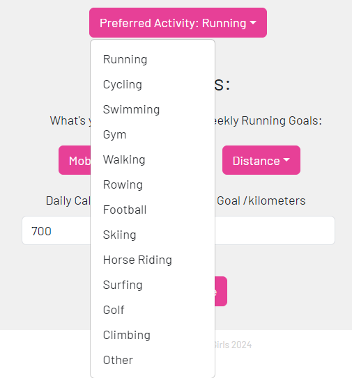

# MLA Fitness App
# Frontend Components

Components folder contains the frontend react files displayed to the user for the app. We have added two new frontend components to the application:
- User Profile - userProfile.js
- Homepage - homepage.js

# User Profile
The user profile was added to the application so that the user can view and update their personal information which is being collected during sign up. It is also the page where the user can set their exercising goals.

### Photo of user profile

### Features of user profile
- Displays personal information to the user - first name, surname, email address, date of birth, height and weight.
- There are validation checks set-up in the auth service to validate the email address and dob.
- Fetches the personal information from the /profile endpoint of the auth service.
- User can select their preferred activity, which is used to set the activity type for their weekly goal.
- Displays the user's goals if they have been set - exercise aim, daily calories goal, weekly exercise metric and goal.
- Fetches the goal information from the activity tracking /goal endpoint.
- The user can edit any information in the form and submit to update their profile.
- Submit button posts/puts data to auth and activity tracking endpoints.
- The user profile displays the up to date data for the user.

### User Goals:
The user goals are stored in the activity tracking database in a new goals collection. This is separate from the exercise collection in the db.
#### 1. Exercise Aim:
    The user can select what their aim is from a dropdown list, this can be one of: Fitness, weight loss, weight gain, mobility, flexibility and body toning.

#### 2. Daily Calories Goal:
    The user inputs a value which sets their goal for amount of calories burned per day. This is used on the homepage when displaying their daily calories amount.
#### 3. Weekly Goal:
    This goal contains 4 properties - exerciseType, goalType, goalUnit and goalValue. The user selects their preferred activity from the dropdown list, this is the exerciseType. The user selects the goal metric from the dropdown list - this is the goalType. The goalUnit is automatically set according to the goalType. The user then inputs the value of the goal which they want to meet each week, this is the goalValue.
 

# Homepage
The homepage was added to the application as a landing page for the user, rather than being sent straight to the track new exercise page. The aim was to have a fun and interactive homepage, with a focus on showing a daily overview of the user's latest exercising.

### Photo of homepage
This user has tracked a exercise today so we can see the last exercise showing, along with calories being logged and displayed in the radial graph.

This user has not tracked any exercises yet so we can see there is no data to be displayed on the homepage. The content shown to the user changes to inform the new user how to track an exercise.

### Features of homepage
- The homepage greets the user dynamically - Hello, {username}!
- The homepage asks the user how they are feeling, by selecting the emojis the colour theme of the navBar and radial chart changes. See below image, the icon has been clicked so the colour scheme is now blue.

- The homepage fetches the user's last tracked exercise using graphQL schema from the analytics service.
- The last tracked exercise is displayed to the user, showing the exercise type, duration and date. If the user has not tracked an exercise a link to the track exercise page is rendered instead.
- The homepage fetches the calories that the user has burned today using graphQL schema from the analytics service.
- The homepage fetches the daily calories goal that the user has set using graphQL scheme from the analytics service. If the user has not set this goal then a default value of 500 is set.
- The calories burned is displayed to the user in a radial chart. It is the percentage of the daily calories goal the user has set (or the default value).
- A link to the user profile is provided with a message to show where they can set their goals.

# Testing
The react testing library is used to test frontend components of this application using Jest.

#### The homepage is being testing via the hompage.test.js file:
    - It mocks the graphQL queries.
    - It checks that the homepage is rendered properly.
    - It checks that the title is personalised with the user's username.
    - A check for the change in color scheme was attempted but we encountered difficulties when rendering the radial chart completely within the test, so there was not a component available to compare the color with.
    - A check for the rendering of the last exercise type was attempted but we encountered difficulties when mocking the queries properly so this results data was not available.

